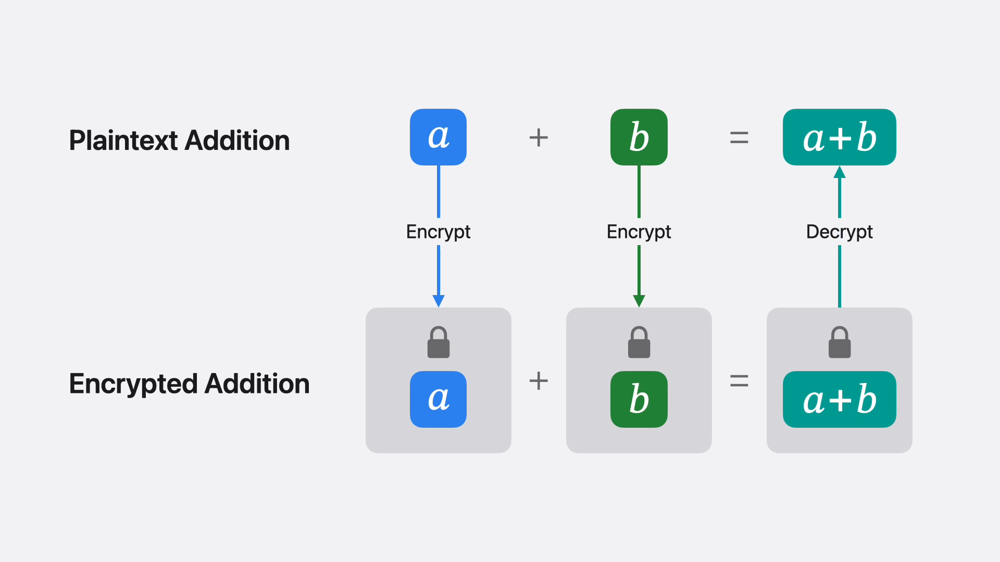
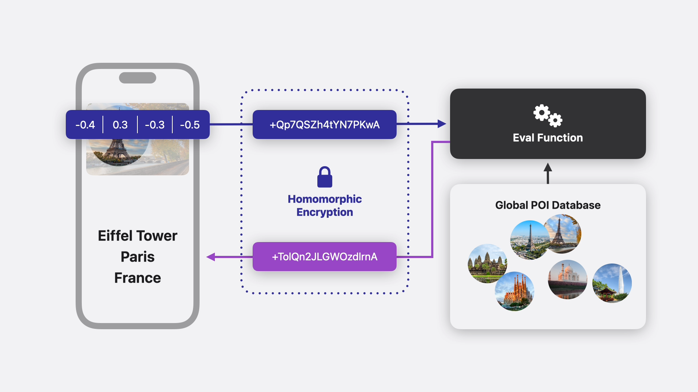

<h1 align="center">Chiffrement Homomorphique<br>applique au Machine Learning</h1>

<p align="center">
  <strong>Projet de Cryptographie &mdash; Protection de l'information</strong><br>
  FISE2 &bull; Télécom Saint-Etienne &bull; 2024&ndash;2025
</p>

<p align="center">
  <a href="rapport/rapport.md"></a>
  <a href="src/"></a>
  <a href="presentation/revealjs/pres.md"></a>
  <a href="#licence"></a>
</p>

---

## Apercu

Le chiffrement homomorphique permet d'effectuer des calculs sur des donnees **chiffrees** sans jamais les dechiffrer. Le resultat, une fois dechiffre, correspond exactement a celui qu'on aurait obtenu en clair.

<p align="center">
  
</p>

Ce projet explore ce paradigme sous deux angles :

1. **Theorie & Implementations** &mdash; Etude detaillee et implementation pedagogique de deux schemas de chiffrement homomorphe : **Paillier** (partiel, addition) et **BGV** (complet, addition + multiplication).

2. **Application au Machine Learning** &mdash; Analyse du cas pratique d'Apple utilisant le schema **BFV** pour la reconnaissance d'image sur des donnees chiffrees (recherche visuelle dans la galerie photo).

<p align="center">
  
</p>

---

## Table des matieres

- [Apercu](#apercu)
- [Schemas implementes](#schemas-implementes)
- [Structure du projet](#structure-du-projet)
- [Prerequis](#prerequis)
- [Build](#build)
- [Utilisation du code](#utilisation-du-code)
- [Contenu du rapport](#contenu-du-rapport)
- [References](#references)
- [Auteurs](#auteurs)
- [Licence](#licence)

---

## Schemas implementes

| Schema | Type | Operations | Securite | Fichier |
|--------|------|------------|----------|---------|
| **Paillier** | Partiel | Addition | Logarithme discret | [`src/paillier.py`](src/paillier.py) |
| **BGV** | Complet (FHE) | Addition + Multiplication | LWE / Ring-LWE | [`src/bgv.py`](src/bgv.py) |

### Paillier &mdash; Chiffrement homomorphe partiel

Permet l'addition sur des entiers chiffres. La multiplication de deux chiffres dans l'espace `Z_n^2` correspond a l'addition des messages en clair :

```
E(m1) * E(m2) = E(m1 + m2)  mod n^2
```

### BGV &mdash; Chiffrement homomorphe complet

Permet l'addition **et** la multiplication sur des entiers chiffres. Base sur le probleme LWE (Learning With Errors), resistant aux attaques quantiques :

```
Addition :      (c0, c1) + (c0', c1') = (c0 + c0', c1 + c1')
Multiplication : necessite une relinearisation pour revenir a 2 composantes
```

---

## Structure du projet

```
crypto-homomorphisme/
|
|-- rapport/                     Rapport complet (Markdown -> PDF)
|   |-- rapport.md                 Source du rapport
|   |-- Makefile                   Build via pandoc + xelatex
|   +-- figures/                   Schemas et illustrations
|
|-- presentation/                Supports de presentation
|   |-- revealjs/                  Slides Reveal.js (pandoc -> HTML)
|   |   |-- pres.md                  Source des slides
|   |   |-- Makefile                 Build
|   |   +-- images/                  Assets visuels
|   |-- manim/                     Slides animees Manim
|   |   |-- main.py                  Source des animations
|   |   |-- Makefile                 Build
|   |   +-- assets/                  SVG et ressources
|   +-- oral.md                    Notes de presentation orale
|
|-- src/                         Implementations Python
|   |-- paillier.py                Chiffrement de Paillier
|   +-- bgv.py                     Chiffrement BGV
|
|-- Makefile                     Build global
|-- requirements.txt             Dependances Python
+-- .gitignore
```

---

## Prerequis

- **Python** >= 3.9
- **pandoc** + **xelatex** (pour le rapport PDF)
- Dependances Python :

```bash
pip install -r requirements.txt
```

> Les packages `manim` et `manim-slides` ne sont necessaires que pour la presentation animee.

---

## Build

```bash
# Tout construire (rapport + presentation)
make

# Rapport seul (genere rapport/rapport.pdf)
make rapport

# Presentation Reveal.js seule (genere presentation/revealjs/pres.html)
make pres

# Presentation Manim seule
make pres-manim

# Nettoyage des artefacts generes
make clean
```

---

## Utilisation du code

### Paillier

```bash
python src/paillier.py
```

```
Generation des cles :
   p = 7, q = 11
   n = 77, g = 78, lambda = 30
--------------------------------------------------
Entrez le message m1 (entier) : 3
Entrez le message m2 (entier) : 5
--------------------------------------------------
 Addition homomorphe:
   c_add = c1 * c2 mod n^2 = 3790
--------------------------------------------------
 Dechiffrement:
   m = L(u) * mu mod n = 8
--------------------------------------------------
Resultat attendu : 3 + 5 mod n = 8
  Correct
```

### BGV

```bash
python src/bgv.py
```

```
Entrez le message m1 (entier entre 0 et t-1) : 4
Entrez le message m2 (entier entre 0 et t-1) : 5
--------------------------------------------------
Addition homomorphe : 4 + 5 = 9       Correct
Multiplication homomorphe : 4 * 5 = 20   Correct
```

> **Note :** Ces implementations sont pedagogiques et utilisent des parametres simplifies.
> Elles ne sont pas destinees a un usage en production.

---

## Contenu du rapport

| Chapitre | Sujet |
|----------|-------|
| **1. Le chiffrement homomorphique** | Definition formelle, principe de fonctionnement, correction & bootstrapping, classes de fonctions (partielles vs completes) |
| **1.1 Paillier** | Generation de cles, chiffrement, propriete additive, dechiffrement, exemple numerique detaille |
| **1.2 BGV** | LWE, generation de cles polynomiales, encodage par facteur d'echelle, addition & multiplication homomorphe, relinearisation, noise budget |
| **2. Reconnaissance d'image chiffree** | Vecteurs d'embedding, quantification, batching, cas pratique Apple (BFV), perspectives et limitations |

---

## References

**Principes generaux**
- [Homomorphic Encryption &mdash; Introduction](https://homomorphicencryption.org/introduction/)
- [Chiffrement homomorphe &mdash; Wikipedia](https://fr.wikipedia.org/wiki/Chiffrement_homomorphe)
- [Statistique Canada &mdash; Chiffrement homomorphe](https://www.statcan.gc.ca/fr/science-donnees/reseau/chiffrement-homomorphe)

**Fondements mathematiques**
- [Jeremy Kun &mdash; FHE Overview](https://www.jeremykun.com/2024/05/04/fhe-overview/)
- [Daniel Lowengrub &mdash; Fully Homomorphic Encryption](https://www.daniellowengrub.com/blog/2024/01/03/fully-homomorphic-encryption)
- [CipheredDuck (YouTube)](https://www.youtube.com/@CipheredDuck)

**Schemas specifiques**
- [BFV vs BGV &mdash; Crypto StackExchange](https://crypto.stackexchange.com/questions/98204/what-is-the-difference-between-the-fully-homomorphic-bfv-and-bgv-schemes)
- [CKKS &mdash; Introduction (YouTube)](https://www.youtube.com/watch?v=iQlgeL64vfo)

**Applications**
- [Apple &mdash; Homomorphic Encryption for ML](https://machinelearning.apple.com/research/homomorphic-encryption)
- [Zama &mdash; Encrypted Image Filtering (HuggingFace)](https://huggingface.co/spaces/zama-fhe/encrypted_image_filtering)
- [Zama &mdash; Concrete ML](https://github.com/zama-ai/concrete-ml)

---

## Auteurs

| | Nom | GitHub |
|---|-----|--------|
| | **Justin BOSSARD** | [@realnitsuj](https://github.com/realnitsuj) |
| | **Tom MAFILLE** | [@0-T0M-0](https://github.com/0-T0M-0) |

Projet realise dans le cadre du cours de **Cryptographie** (Protection de l'information), FISE2 &mdash; Télécom Saint-Étienne.

---

## Licence

Ce projet est distribue a des fins educatives. Le code source est disponible sous licence [MIT](https://opensource.org/licenses/MIT).
